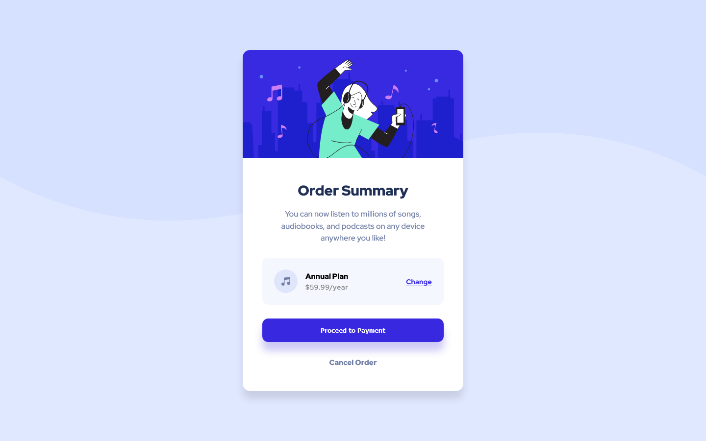

# Frontend Mentor - Order summary card solution

This is a solution to the [Order summary card challenge on Frontend Mentor](https://www.frontendmentor.io/challenges/order-summary-component-QlPmajDUj). Frontend Mentor challenges help you improve your coding skills by building realistic projects.

## Table of contents

- [Overview](#overview)
  - [The challenge](#the-challenge)
  - [Screenshot](#screenshot)
  - [Links](#links)
- [My process](#my-process)
  - [Built with](#built-with)
  - [What I learned](#what-i-learned)
  - [Continued development](#continued-development)
- [Author](#author)

## Overview

### The challenge

Users should be able to:

- See hover states for interactive elements

### Screenshot

### Links

- Solution URL: [GitLab Repository](https://gitlab.com/josetruyol/fm-order-summary-component)
- Live Site URL: [GitLab Page](https://josetruyol.gitlab.io/fm-order-summary-component/)

## My process

### Built with

- Semantic HTML5 markup
- CSS custom properties
- Flexbox
- Mobile-first workflow
- [React](https://reactjs.org/) - JS library
- [Styled Components](https://styled-components.com/) - For styles

### What I learned

This is the first time I used Style Components. It's seems that this will be a main component in future developments.

### Continued development

After this challenge I will focus on perfect my HTML and CSS, focused on page layout.

## Author

- Website - [truyol.dev](https://truyol.deev)
- Frontend Mentor - [@xolott](https://www.frontendmentor.io/profile/xolott)
